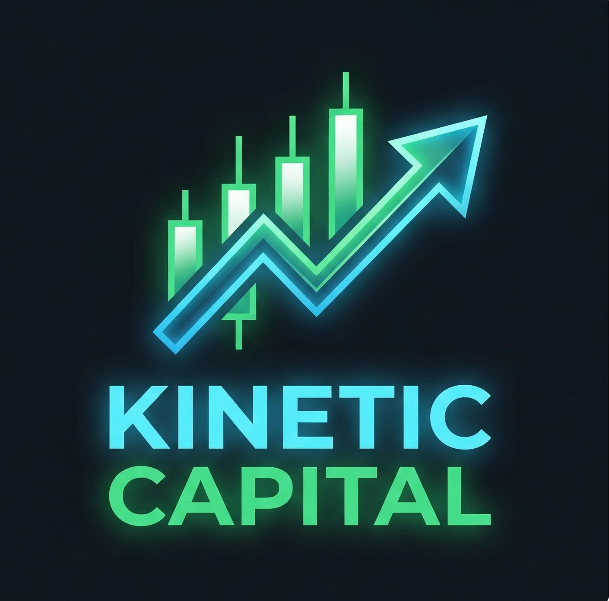

# ⚡ Kinetic Capital — Portfolio Terminal

> Internal investment analyst engine with AI-powered insights, efficient frontier simulation, stress testing, live market data, and full PWA offline support.



---

## 🚀 Live App

**GitHub Pages:** `https://YOUR-USERNAME.github.io/kinetic-capital`

---

## 📦 What's Inside

| File | Purpose |
|------|---------|
| `index.html` | Full app — single-file, self-contained |
| `sw.js` | Service worker — offline caching |
| `manifest.json` | PWA manifest — install prompt, icons |
| `icon-192.png` | App icon (192×192) |
| `icon-512.png` | App icon (512×512) |
| `icon-180.png` | Apple touch icon (180×180) |
| `chart.umd.min.js` | Chart.js — bundled locally |
| `math.min.js` | math.js — bundled locally |
| `404.html` | GitHub Pages SPA redirect |
| `.nojekyll` | Disables Jekyll on GitHub Pages |

---

## 🔧 Deploy to GitHub Pages (5 minutes)

### Option A — GitHub.com UI (easiest)

1. Create a new repo on GitHub (public or private)
2. Upload all files in this folder to the repo root
3. Go to **Settings → Pages**
4. Under **Source**, select `Deploy from a branch`
5. Set branch to `main`, folder to `/ (root)`
6. Click **Save**
7. Your app is live at `https://YOUR-USERNAME.github.io/REPO-NAME`

### Option B — Git CLI

```bash
git init
git add .
git commit -m "Initial deploy — Kinetic Capital v8"
git branch -M main
git remote add origin https://github.com/YOUR-USERNAME/kinetic-capital.git
git push -u origin main
```

Then enable Pages in Settings as above.

### Option C — GitHub CLI

```bash
gh repo create kinetic-capital --public --source=. --remote=origin --push
# Then enable Pages in Settings
```

---

## 📱 Install as PWA

Once hosted, visit the URL in Chrome/Edge/Safari:

- **Desktop:** Click the install icon (⊕) in the address bar
- **Android:** Tap the banner or browser menu → "Add to Home Screen"
- **iOS Safari:** Tap Share → "Add to Home Screen"

The app works **fully offline** after the first load — all portfolio math, charts, stress tests, and AI analysis (with cached responses) work without internet.

---

## 🔑 API Keys

All keys are stored in your **browser's localStorage** — they never leave your device except to call the respective API directly.

| Key | Where to get | What it unlocks |
|-----|-------------|----------------|
| **Groq** (free, `gsk_...`) | [console.groq.com/keys](https://console.groq.com/keys) | AI Scan Pulse, Grok Analysis, Portfolio Picks |
| **xAI** (paid, `xai-...`) | [console.x.ai](https://console.x.ai) | Alternative AI provider (Grok 3) |
| **FMP** | [financialmodelingprep.com](https://financialmodelingprep.com) | Live ETF quotes, news feed |

> **Note:** Live market quotes require the app to be hosted (not opened as a `file://`) due to browser CORS policy. GitHub Pages hosting resolves this automatically.

---

## ⚡ Features

### Portfolio Management
- 17 ETF universe across Treasury, Fixed Income, US Equity, International, Alternatives
- Multiple portfolios with sidebar comparison
- Weight sliders, lock/unlock positions, normalize to 100%
- Group/ungroup by asset class, column visibility toggles
- Portfolio notes and thesis per strategy
- Import/Export: JSON (full, portfolios-only, keys-only), CSV roundtrip

### AI Analysis (requires Groq or xAI key)
- **Scan Pulse** — runs on any tab, shows headline + reallocation actions + risk flags
- **Grok Analysis** — deep portfolio breakdown with correlation risk map
- **Grok's Portfolio Picks** — AI generates a competing optimized portfolio

### Market Data (requires FMP key)
- Live ETF quotes with daily change
- Financial news feed with sentiment tagging
- Macro indicators panel

### Analytics
- **Efficient Frontier** — 2,000 simulated portfolios, optimal strategy candidates
- **10-Year Monte Carlo** — median + P5/P95 confidence band per optimal strategy
- **Stress Test** — 12 scenarios (Oil shock, Equity crash, Fed hike, Tech crash, etc.)
- **Income Floor** — monthly/annual cash flow, tax drag toggle, 20-year growth projection
- **Rebalance** — drift monitoring, suggested trades, SPY/60-40 benchmark comparison
- **Stat Card Breakdowns** — click any header stat for detailed contribution analysis

### PWA
- Installs to home screen on any device
- Full offline functionality for all calculations and UI
- Auto-saves session to localStorage every 60 seconds
- Unsaved changes indicator

---

## 🛠️ Local Development

```bash
# Serve locally (required for API calls to work)
npx serve .
# or
python3 -m http.server 8080

# Then open: http://localhost:8080
```

---

## 🔄 Updating

To update the deployed app:

```bash
# Replace index.html with new version
git add index.html
git commit -m "Update app to v8.1"
git push
```

GitHub Pages will redeploy automatically (usually within 60 seconds).

To bust the service worker cache for users, increment the `CACHE_NAME` in `sw.js`:
```js
const CACHE_NAME = 'kinetic-capital-v2'; // bump version
```

---

## 🏗️ Architecture

```
kinetic-capital/
├── index.html          ← Entire app (HTML + CSS + JS, ~510KB)
├── sw.js               ← Service worker (cache-first + network-only for APIs)
├── manifest.json       ← PWA manifest
├── icon-*.png          ← App icons (base64 embedded in HTML too)
├── chart.umd.min.js    ← Chart.js 4.4.0 (local bundle)
├── math.min.js         ← math.js 11.8.0 (local bundle)
├── 404.html            ← GitHub Pages SPA fallback
├── .nojekyll           ← Disables Jekyll processing
└── .gitignore
```

**Dependencies (all bundled locally, no CDN required after first load):**
- [Chart.js 4.4.0](https://www.chartjs.org/) — charts and visualizations
- [math.js 11.8.0](https://mathjs.org/) — matrix math for portfolio variance (W^T · Σ · W)

---

## 📐 Portfolio Math

Portfolio variance uses the full covariance matrix:

```
σ_p = √(W^T · Σ · W)
```

Where `Σ[i][j] = ρ[i][j] · σ_i · σ_j`

Sharpe Ratio: `SR = (E[R] - R_f) / σ_p`

All 17×17 correlation values are sourced from your original model data.

---

## 📄 License

Private / Internal use — Kinetic Capital.
