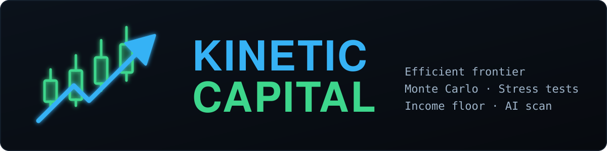
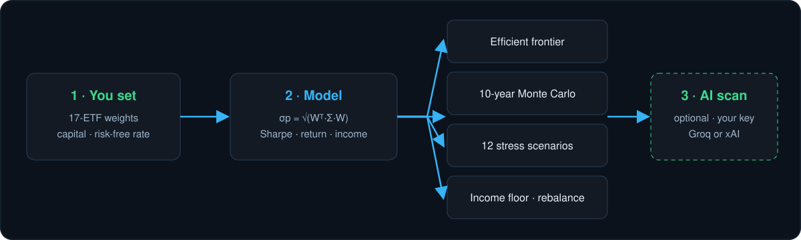
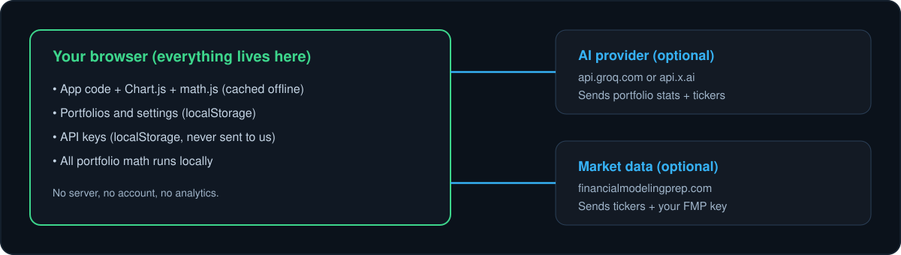

<p align="center"></p>

# Kinetic Capital

A private portfolio terminal. Build a strategy from a 17-ETF universe, then see its return, volatility and Sharpe ratio, run an efficient-frontier simulation, a 10-year Monte Carlo, twelve stress scenarios, an income floor and a rebalance plan. An optional AI scan gives a second opinion. Everything runs in your browser.

> Return, yield, volatility and correlation inputs are static long-run model assumptions, not live data. Not investment advice.

## Live

| | URL |
|---|---|
| Landing | https://johnlaz.github.io/kinetic/ |
| App | https://johnlaz.github.io/kinetic/app/ |

Install it from the app URL (Chrome/Edge install icon, Android "Add to Home screen", iOS Share, "Add to Home Screen"). It works offline after the first load.

## How it works

<p align="center"></p>

Portfolio variance uses the full covariance matrix, `σp = √(Wᵀ·Σ·W)` with `Σ[i][j] = ρ[i][j]·σi·σj`, and Sharpe is `(E[R] − Rf) / σp`.

## Repo layout

```
/index.html            landing page
/README.md
/docs/                 README visuals (SVG only)
/app/index.html        the app (single file)
/app/manifest.json
/app/sw.js             service worker (cache version tied to APP_VERSION)
/app/icon-192.png
/app/icon-512.png
/app/chart.umd.min.js  Chart.js 4.4.0, vendored for offline use
/app/math.min.js       math.js 11.8.0, vendored for offline use
```

## AI and model setup

Open Settings and paste a key. The provider is detected from the prefix.

| Key prefix | Provider | Default model |
|---|---|---|
| `gsk_` | Groq (free tier) | `llama-3.3-70b-versatile` |
| `xai-` | xAI | `grok-3` (falls back to `grok-3-latest`, `grok-2-1212` until you pick a model) |

Saving a key loads the provider's current chat models into the **Model** picker, and **Refresh** reloads them. The list is additive: your default and your saved choice are always kept, flagged with a warning if the provider no longer lists them, and never swapped automatically.

Market data and news use a Financial Modeling Prep key (optional).

## Data and privacy

<p align="center"></p>

Portfolios, settings and keys live in `localStorage`. The only network calls go from your browser to the AI provider (portfolio stats and tickers) and to FMP (tickers and your key). "Export all" asks before including keys in the file.

## Deploy and update

Serve the repo root with GitHub Pages (Settings, Pages, branch `main`, folder `/ (root)`). To release an update:

1. Change `APP_VERSION` in `app/index.html` and `VERSION` in `app/sw.js` to the same new number.
2. Commit and push. Open installs show a "new version ready, Reload" prompt.

Local test: `python3 -m http.server 8080` from the repo root, then open `/app/`.

## Changelog

### 8.1.0
- Landing page at the root, app moved to `/app/` (existing installs must be reinstalled).
- Real square icons; removed ~356 KB of embedded base64 images (app file 526 KB to ~180 KB).
- Chart.js and math.js vendored, so first offline launch works.
- Service worker: network-first HTML, strict precache, update prompt, cache name tied to the version.
- AI model picker with fetch-on-key-save and Refresh (additive, never swaps).
- Removed hardcoded March 2026 macro text, fake static analysis and the macro panel; prompts no longer assert market figures.
- Responsive layout (drawer sidebar, bottom tab bar), logo-based palette, keyboard and screen-reader fixes.
- "Export all" makes API keys opt-in.

### 8.0
- Previous single-file release.

&copy; 2026 LAZLAB Creations. All Rights Reserved. &middot; lazlab.io@gmail.com
